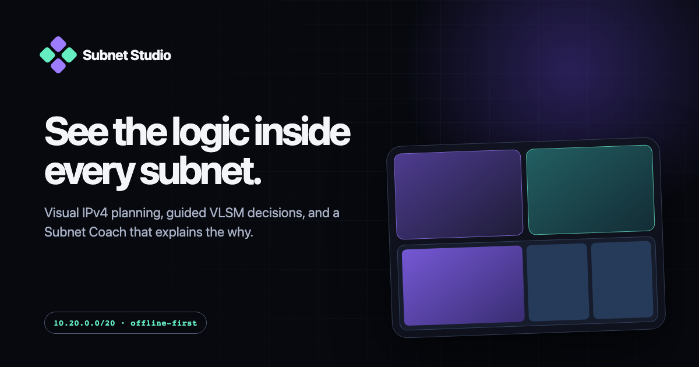

# Subnet Studio

**An explainable, offline-first visual studio for learning and planning IPv4 subnets.**

[](https://github.com/thomasaiwilcox/subnet-studio/actions/workflows/ci.yml)

[Try the live application](https://thomaswilcox.com/subnetvisualiser/) · [Read the architecture](docs/ARCHITECTURE.md) · [Contribute](CONTRIBUTING.md)



Subnet Studio turns CIDR address space into something you can see and manipulate. Split networks, construct genuine partial joins, preview VLSM allocations, and inspect why each boundary is valid—all without sending workspace data anywhere.

It is designed for networking students, teachers, certification candidates, infrastructure engineers, and anyone who wants to reason about subnetting spatially instead of treating it as a collection of formulas.

## What makes it different

- **Manipulable address space:** split, allocate, deallocate, select siblings, and join aligned subnet groups directly on a proportional binary map.
- **Subnet Coach:** preview an atomic VLSM plan and step through request parsing, provider reservations, prefix sizing, placement, retained space, and efficiency.
- **Safe experimentation:** every domain change is undoable, the timeline can preview and restore earlier states, and lessons preserve the original workspace.
- **Learning tools:** guided lessons, six practical scenarios, a `/0`–`/32` prefix playground, a live binary CIDR lens, and precise invalid-action explanations.
- **Professional planning:** Azure, AWS, GCP, and custom reservation profiles; capacity and waste analysis; inventory; share links; and HTML, Markdown, SVG, PNG, CSV, and JSON exports.
- **Private and portable:** no telemetry, accounts, external runtime assets, fonts, or background requests. The application compiles to one standalone HTML file.

Subnet Studio currently supports IPv4. Its CIDR engine explicitly handles `/0`, RFC 3021 `/31` networks, `/32` host routes, unsigned address boundaries, provider limits, and a safety limit of 2,048 rendered leaves.

## Quick start

Requirements: [Node.js](https://nodejs.org/) 22 or later and npm.

```sh
npm ci
npm run dev
```

Vite prints the local development URL. To run the complete fast verification suite:

```sh
npm run check
```

This type-checks the source, runs unit tests, creates the production build, and verifies its offline artifact contract. Browser tests require Playwright's browsers once per machine:

```sh
npx playwright install
npm run test:e2e
```

Useful commands:

| Command | Purpose |
| --- | --- |
| `npm run dev` | Start the local Vite development server |
| `npm run typecheck` | Run strict TypeScript validation |
| `npm test` | Run the Vitest unit suite |
| `npm run test:e2e` | Run all functional and visual Playwright tests |
| `npm run test:e2e:ci` | Run browser behaviour tests without platform-specific snapshots |
| `npm run test:visual` | Run the reviewed macOS visual baselines |
| `npm run build` | Build, verify, and publish the standalone artifacts locally |
| `npm run check` | Run type-checking, unit tests, build, and artifact verification |

## Production artifacts

`npm run build` produces exactly:

```text
dist/
├── index.html
└── social-preview.png
```

The build also copies those files to the project root for simple static hosting. `index.html` works independently from a local file with all application code, styles, and icons embedded. The PNG is publishing metadata only.

Deploy both files to any static host, or open `dist/index.html` directly. The canonical deployment target is `https://thomaswilcox.com/subnetvisualiser/`.

## Project structure

```text
src/                  TypeScript domain, persistence, export, and UI modules
tests/                Unit, browser, mobile, security, and visual tests
scripts/              Artifact verification and local publishing scripts
assets/               Source material for publication assets
downloaded-site/      Untouched historical implementation reference
docs/                 Architecture, roadmap, release, and repository documentation
.github/               Issue forms, pull-request guidance, CI, and releases
```

The canonical workspace model is intentionally separate from DOM rendering. State transformations are validated and transactional; transient plan and history previews never enter persistence, exports, or autosave. See [the architecture guide](docs/ARCHITECTURE.md) for module boundaries and invariants.

## Data compatibility and privacy

Workspace JSON and share links use schema version 1. Earlier unversioned exports and links are deliberately rejected rather than guessed at. Imported state is schema-validated before it can replace the workspace.

Autosave remains in browser-local storage. Workspace data leaves the browser only when the user explicitly copies a share link or exports a file. There is no telemetry or runtime network dependency.

## Correctness notice

Subnet Studio is extensively tested, but network plans can have operational consequences. Verify exported plans against your organisation's requirements and current provider documentation before changing production infrastructure. Provider profiles model prefix limits and reserved-address counts, not every service-specific cloud policy.

If you find a calculation that appears incorrect, please use the dedicated **CIDR correctness report** issue form and include the smallest reproducible workspace.

## Contributing

Bug reports, teaching ideas, accessibility improvements, documentation fixes, and carefully scoped features are welcome. Start with [CONTRIBUTING.md](CONTRIBUTING.md), the [architecture guide](docs/ARCHITECTURE.md), and the [project roadmap](docs/ROADMAP.md).

Please read the [Code of Conduct](CODE_OF_CONDUCT.md). Security and privacy concerns should follow [SECURITY.md](SECURITY.md), not a public issue.

## Historical reference

The downloaded predecessor is preserved unchanged at `downloaded-site/index.html`. It exists for design and behaviour comparison and is not part of the production build.

## Licence

Subnet Studio is available under the [MIT Licence](LICENSE).
